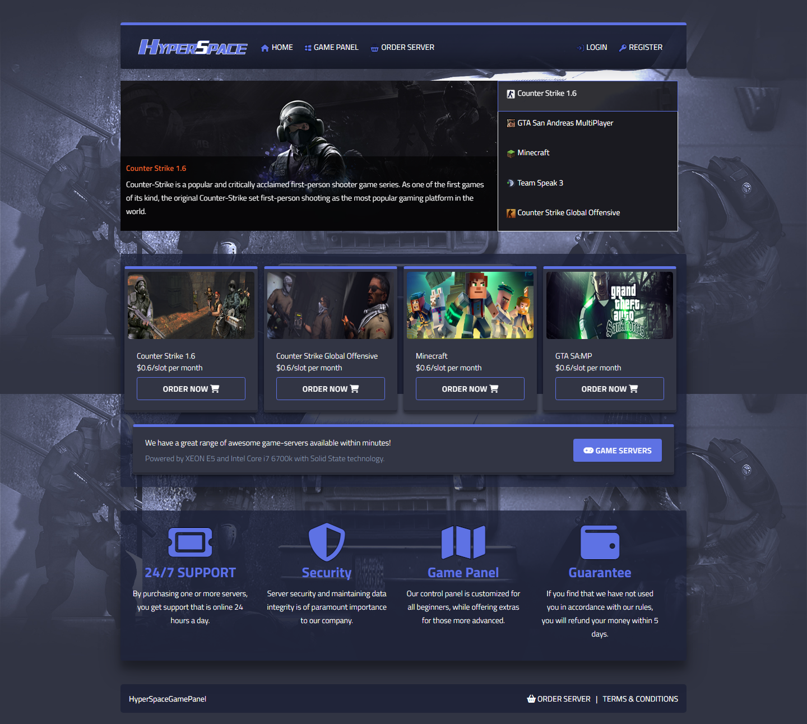

# HyperSpaceGamePanel
HyperSpaceGamePanel: A game panel built with Spring Boot and Thymeleaf, designed to manage game servers and improve their performance, stability, and accessibility.

UI UPDATED:

## Table of Contents

Module | Status
-------|-------
Registration | Completed :white_check_mark:
Spring Security | Completed :white_check_mark:
Login | Implemented login logic :white_check_mark:, Forgot password: Completed :white_check_mark:
ORDER GAME SERVER | In Progress :clock10:
Profile Management | Not Started :x:
Game Panel | Not Started :x:

